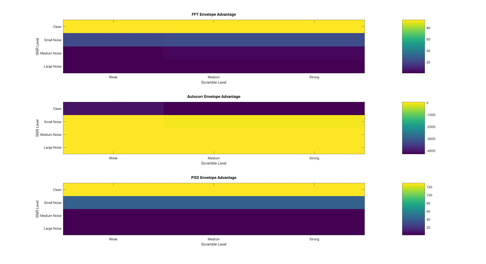
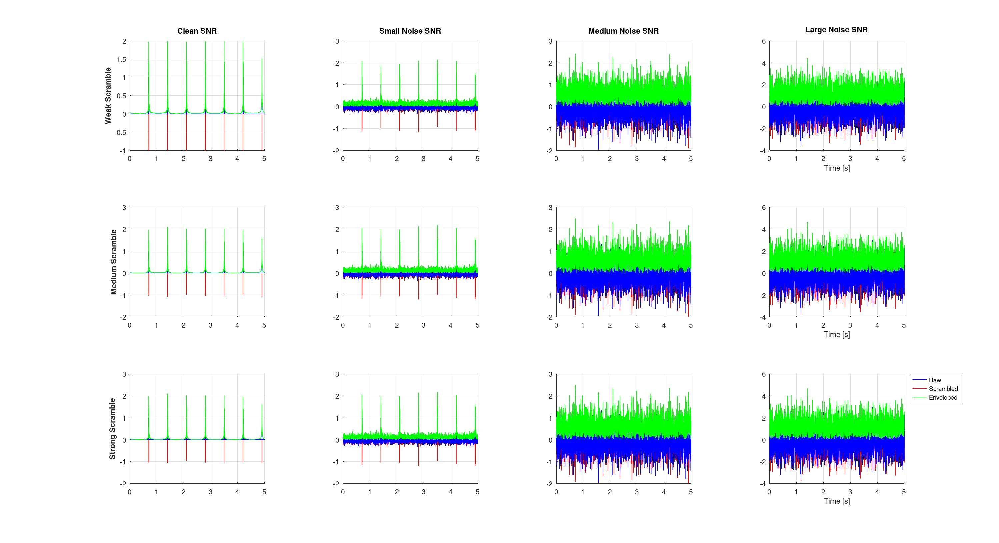
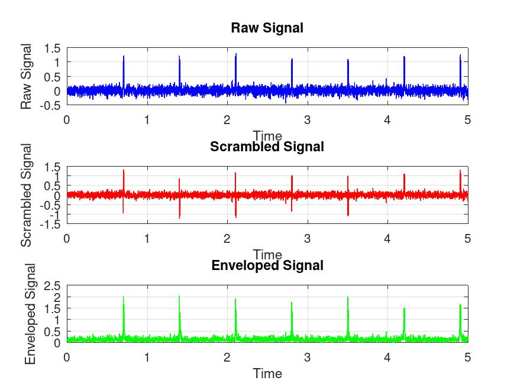

# Side-Channel Pulsar Analysis

## Table of Contents

1. [Introduction](#introduction)
   - [What is a SCA?](#what-is-a-side-channel-attack)
   - [Project Goals](#project-goals)
2. [Project Overview](#project-overview)
   - [Autocorrelation Leakage](#autocorrelation-leakage)
   - [Spectral Fingerprinting](#spectral-fingerprinting)
   - [Envelope Detection](#envelope-detection)
   - [Signal Scrambling and Descrambling](#signal-scrambling-and-descrambling)
   - [Seed Recovery/Brute-Force Attack](#seed-recovery)
3. [Takeaways](#takeaways)
   - [What techniques can detect data leakage in signals?](#what-techniques-can-detect-data-leakage-in-signals)
   - [How does scrambling level and the SNR affect pulsar data leakage?](#how-does-scrambling-level-and-the-snr-affect-pulsar-data-leakage)
   - [Can an attacker determine the seed used to obfuscate the signal?](#can-an-attacker-determine-the-seed-used-to-obfuscate-the-signal)
4. [References](#references)

## Introduction

### What is a Side-Channel Attack?

- **Side-Channel Attacks (SCA) are noninvasive attacks that target the implementation of a cryptographic algorithm instead of exploiting statistical/mathematical weaknesses.**
	- **Active Attacks** include fault injections such as EM interference, laser glitching, and clock pin tampering. The goal of these attacks is to use side channel techniques to alter the behavior of a device, such as making the device skip instructions or reveal secret information. 
	- **Passive Attacks** observe information a device unintentionally leaks through power usage, timing, or EM signals. The goal of these attacks is to use side channel techniques to expose device secrets.

- This project focuses on passive electromagnetic (EM) SCAs, which measure EM emissions from integrated circuits (ICs) during operation. EM signals are strongest where current switches rapidly, especially during transistor activity.
	- **Intentional EM emanations** come from normal current flow and are observable across full frequency bands. Attackers try to isolate the data path using a small, sensitive EM probes at higher frequencies.
 	- **Unintentional EM emanations** result from electrical/EM coupling between components, which generates modulated signals that may reveal internal behavior.

- There are multiple techniques/strategies used by attackers to determine secrets in EM signals.
	- **Simple EM Analysis** (SEMA) uses one time-domain trace to directly gain knowledge about the device. SEMA can only work when an attacker has prior knowledge about the device. Oftentimes, startup patterns on a device include information about device secret keys.
	- **Differential EM Analysis** (DEMA) extracts non-visible information from the device, which is especially useful for unknown devices. This involves using a self-referencing approach where an analyzed signal is compared with the signal at a different time or location on the device. DEMA exposes how signals propagate and the internal strcutural details of a device, which can assist in reverse engineering devices.

- **EM SCA Countermeasures** include  IC shielding, reducing circuit coupling, and adding noise such as dummy computations to hide real data.

### Project Goals

- **Pulsar signals** are periodic electromagnetic pulses from rotating neutron stars. This behavior displays patterns in high noise environments, and can be an effective model in understanding simple EM side-channel techniques.
- The primary [objectives](#takeaways) of this project are as follows:
	1. What techniques can detect data leakage in signals?
	2. How does scrambling level and the SNR affect pulsar data leakage?
	3. Can an attacker determine the seed used to obfuscate the signal?

---

## Project Overview

### Autocorrelation Leakage

#### Method

#### Results

---

### Spectral Fingerprinting

#### Method

#### Results

---

### Envelope Detection

#### Method

- **Enveloping** is a process that smooths signals and outlines its extremes.
- The **Hilbert transform** was used to 

#### Results

- It was found that enveloping the signal resulted in improved spectral results. The advantage of enveloping the signal was consistent across all scrambling levels, while noise reduced the advantage. But, in high noise environments, spectral analysis was reduced across the board.

- Autocorrelation was shown to be significiantly less effective for the leakage.




```bash
LEAKAGE PER SCRAMBLING:

  --- Weak   Scramble ---
    FFT ratio:       raw 21.0289 → env 35.7219
    Autocorr ratio:  raw 57.6587 → env 60.1267
    PSD ratio:       raw 27.9163 → env 51.0598
    FFT Env advantage:       Δ = 29.4265
    Autocorr Env advantage:  Δ = -984.8684
    PSD Env advantage:       Δ = 42.9061

  --- Medium Scramble ---
    FFT ratio:       raw 21.0289 → env 36.4163
    Autocorr ratio:  raw 57.6587 → env 59.7550
    PSD ratio:       raw 27.9163 → env 51.6677
    FFT Env advantage:       Δ = 30.0338
    Autocorr Env advantage:  Δ = -1049.6350
    PSD Env advantage:       Δ = 43.2114

  --- Strong Scramble ---
    FFT ratio:       raw 21.0289 → env 36.4163
    Autocorr ratio:  raw 57.6587 → env 59.7550
    PSD ratio:       raw 27.9163 → env 51.6677
    FFT Env advantage:       Δ = 30.0338
    Autocorr Env advantage:  Δ = -1049.6350
    PSD Env advantage:       Δ = 43.2114

LEAKAGE PER SNR:

  --- Clean  Scramble ---
    FFT ratio:       raw 65.5754 → env 104.9585
    Autocorr ratio:  raw 124.4321 → env 38.6938
    PSD ratio:       raw 94.9915 → env 152.0865
    FFT Env advantage:       Δ = 93.3915
    Autocorr Env advantage:  Δ = -4204.7556
    PSD Env advantage:       Δ = 129.0851

  --- Small Noise Scramble ---
    FFT ratio:       raw 11.6789 → env 29.0597
    Autocorr ratio:  raw 89.6477 → env 75.4846
    PSD ratio:       raw 13.8907 → env 48.2311
    FFT Env advantage:       Δ = 22.5205
    Autocorr Env advantage:  Δ = -15.0589
    PSD Env advantage:       Δ = 40.5631

  --- Medium Noise Scramble ---
    FFT ratio:       raw 3.1430 → env 5.9951
    Autocorr ratio:  raw 9.1464 → env 63.1983
    PSD ratio:       raw 1.4567 → env 3.1022
    FFT Env advantage:       Δ = 2.3793
    Autocorr Env advantage:  Δ = 54.3711
    PSD Env advantage:       Δ = 1.5891

  --- Large Noise Scramble ---
    FFT ratio:       raw 3.7184 → env 4.7259
    Autocorr ratio:  raw 7.4088 → env 62.1391
    PSD ratio:       raw 1.3264 → env 2.4405
    FFT Env advantage:       Δ = 1.0342
    Autocorr Env advantage:  Δ = 53.2587
    PSD Env advantage:       Δ = 1.2014
```

- Additionally, from a visual comparison, the pulsar peaks became very prominent even in high noise and high scrambling situations:
  


---

### Signal Scrambling and Descrambling

#### Method

1. **Seeded RNGs:**
   - A seeded Mersenne Twister PRNG was used.
   - Mersenne Twisters generate a state array based on an input seed, then the state array determines the number being outputted. Each successive integer comes from the previous number, and they all originate from the original state array built from the input seed. Therefore, when calling a Twister PRNG again with the same seed, each successive number from the PRNG stream will be equal.
   - In MATLAB/Octave when rng(seed) is called, the global stream is set, and the resulting random numbers are determined based on the call number.
   - Recalling rng(seed) can reset the global stream and generate repeated numbers, if the random functions are called in the same order.
   
2. **Chunking the Signal:**
   - The signal was separated into individual chunks for scrambling.
     
3. **Scrambling Level 1: Flipping**
   - The chunk had a chance of being randomly flipped
   
4. **Scrambling Level 2: Amplitude Shifting**
   - The chunk was scaled with a random value.
   
5. **Scrambling Level 3: Time Jitter**
   - The chunk was circshifted by a random time.
     
6. **Descrambling:**
   - The reverse operations were looped through each chunk in the following order:
     	- 1. Reverse Time Jitter
     	- 2. Reverse Amplitude shifting
     	- 3. Reverse Bit Flipping
   - The correlation coefficient of the descrambled vs raw signal was equal to 1, verifying descrambling worked.

#### Results

- Scrambling Levels Compared with Raw and Enveloped Signals:


- The scrambling was revealed to be relatively weak, especially in this application. Pulsars are very periodic, which is easy to expose visually and with spectral analysis. In the time domain, especially high-noise environments, though, scrambling was effective in hiding the original signal structure. Scrambling did reduce the effectiveness of spectral analysis.

---

### Seed Recovery

#### Goal

- An attack was simulated where an attacker attempts to recover the scrambling seed using **brute force.**
- **The following assumptions were made:**
  - The attacker has full access to the obfuscated signal.
  - The attacker knows the scrambling/bfuscation methods being used.

#### Method

1. **Leakage Pre-Analysis:**
    - Evaluated leakage metrics on the scrambled signal.
    - The envelope contained the most preserved structure, so envelope correlation became a key scoring component.
    - FFT and PSD ratios were selected as the main spectral fingerprints.
    - Final scoring strategy was defined as: `score = (PSD ratio + log‑scaled FFT ratio) × envelope correlation coefficient`
	
2. **Loop Design:**
    - Nested exhaustive searches: `scrambling levels` × `candidate seeds.`
    
3. **Seed Trials:**
    - The scrambled signal was descrambled with the guessed seed. 
    - Output was normalized.
      
4. **Envelope Matching:**
    - The envelope of the descrambled signal had its correlation coefficient compared to the envelope of the scrambled signal.
    - A value close to `1.0` indicated similar peak structure and helped reject high spectral ratios that were not preserving the original signal's leakage.
    
5. **Spectral Ratio Scoring:** 
    - Computed the `FFT Ratio` and `PSD Ratio`.
    - FFT Ratio was scaled loarithmically to normalize it.
    - Descrambled signals with the highest FFT and PSD ratios hinted towards the best reconstruction of the original signal.
      
6. **Noise Thresholding:** 
    - Applied fast pre-filters:
	    - The FFT, PSD, Envelope median were multiplied by a constant for scaling across noises
		- If the envelope, FFT, or PSD values were outside observed sane ranges, seed was skipped or rejected.
	- This reduced false positives by ensuring sure a seed scored well across all tests, and slightly improved runtime.

#### Results

Multiple batches of small sets of seeds (2^11 to 2^16 possible seeds) were tested. The scoring function showed a **consistent bias toward the correct seed** across noise and scrambling changes, until the seed set became too large. Even when collisions occurred (different seed, similar decoded output), **the true seed always appeared in the Top‑5 candidates** in small sets. Sets at or below 2^15 can successfully be brute forced with the correct seed being the first or second choice while sets started to gain less reliable results at 2^16.

An interesting note is that before implementing noise thresholding, Top‑1 & Top‑5 accuracy hovered around 50–75%, especially failing under high noise. After thresholding, Top‑5 accuracy reached 100%, showing that **thresholding corrected mis‑weighted spectral scores inflated by noise.**
8192
Additionally, the speed of the brute force mechanism is slow. Some potential improvements would be improving speed by using MATLAB instead of Octave, as a lot of the brute force tasks could be parallelized, and MATLAB's parallelization performance is better. Using `parfor` for the brute force loops would greatly reduce runtime. 

##### Test 1 Results: 2048 Possible Seeds on the Same Signal of Varying Noise

```bash
Attack Summary:
Total Sets Brute Forced        : 15
Range of Seeds Guessed         : 1-2048
Successful Recoveries          : 15 (100.00%)
Average Brute-Force Time       : 128.1219 sec

Accuracy Metrics:
Top 1 Accuracy                 : 100.00%
Top 5 Accuracy                 : 100.00%

Seed Recovery Success Rate per Scramble Level:
 Weak   : 100.00%
 Medium : 100.00%
 Strong : 100.00%
Seed Recovery Success Rate per Noise Level:
 Clean  : 100.00%
 Low Noise : 100.00%
 Small Noise : 100.00%
 Medium Noise : 100.00%
 High Noise : 100.00%
 ```

##### Test 2 Results: 4096 Possible Seeds on the Same Signal of Varying Noise

```bash
Attack Summary:
Total Sets Brute Forced        : 15
Range of Seeds Guessed         : 1-4096
Successful Recoveries          : 15 (100.00%)
Average Brute-Force Time       : 143.1173 sec

Accuracy Metrics:
Top 1 Accuracy                      : 100.00%
Top 5 Accuracy                      : 100.00%

Seed Recovery Success Rate per Scramble Level:
 Weak   : 100.00%
 Medium : 100.00%
 Strong : 100.00%
Seed Recovery Success Rate per Noise Level:
 Clean  : 100.00%
 Low Noise : 100.00%
 Small Noise : 100.00%
 Medium Noise : 100.00%
 High Noise : 100.00%
 ```

##### Test 3 Results: 8,192 Possible Seeds on the Same Signal of Varying Noise

```bash
Attack Summary:
Total Sets Brute Forced        : 15
Range of Seeds Guessed         : 1-8192
Successful Recoveries          : 15 (100.00%)
Average Brute-Force Time       : 513.3424 sec

Accuracy/Error Metrics:
Top 1 Accuracy                 : 100.00%
Top 5 Accuracy                 : 100.00%

Seed Recovery Success Rate per Scramble Level:
 Weak   : 100.00%
 Medium : 100.00%
 Strong : 100.00%
Seed Recovery Success Rate per Noise Level:
 Clean  : 100.00%
 Low Noise : 100.00%
 Small Noise : 100.00%
 Medium Noise : 100.00%
 High Noise : 100.00%
```

##### Test 4 Results: 32,768 Possible Seeds on the Same Signal of Varying Noise

```bash

```

##### Test 5 Results: 65,536 Possible Seeds on the Same Signal of Varying Noise

```bash

```

##### Test 6 Results: 4096 Possible Seeds on the Varying Pulsar Signals with Low Noise

```bash

```

##### Test 7 Results: 4096 Possible Seeds on the Varying Pulsar Signals with Medium Noise

```bash

```

---

## Takeaways

### What techniques can detect data leakage in signals?


### How does scrambling level and the SNR affect pulsar data leakage?


### Can an attacker determine the seed used to obfuscate the signal?

When the seed space is small, an attacker could often recover the correct seed as the most likely (Top-1) candidate, regardless of the noise and scrambling levels. In some cases, a different seed generated a very similar descrambled output, which lowered Top-1 Accuracy. However, the system still achieved 100% Top‑5 accuracy, meaning the true seed consistently appeared among the five closest matches. With only 5 possible seeds, an attacker could do further analysis using other datasets to conclusively identify the seed.

For a single threaded process, brute forcing 2^16 seeds required approximately 40 minutes. **A more cryptographically significant number, such as 2^128 seeds, would take about 0.4 nonillion years to brute force!** Even if this system was parallelized, that would still be an **computationally infeasible** scale. At this magnitude, the amount of false-positive seed collisions also increases, raising the possiblity that the Top-5 candidates may not include the correct seed. 

In modern cryptography, this same principle is mirrored: **Sufficiently large key sizes make it computationally infeasible to determine the encryption key through brute‑force, even when the attacker has access to the encrypted data.** Once the number of possible keys becomes extremely large, key recovery by exhaustive search is no longer a practical attack vector.

## References

- Bhunia, Swarup, Mark Tehranipoor. *Hardware Security: A Hands On Learning Approach.* Elsevier Incorporated, 2019.
- Wikipedia & Mathworks Documentation.
